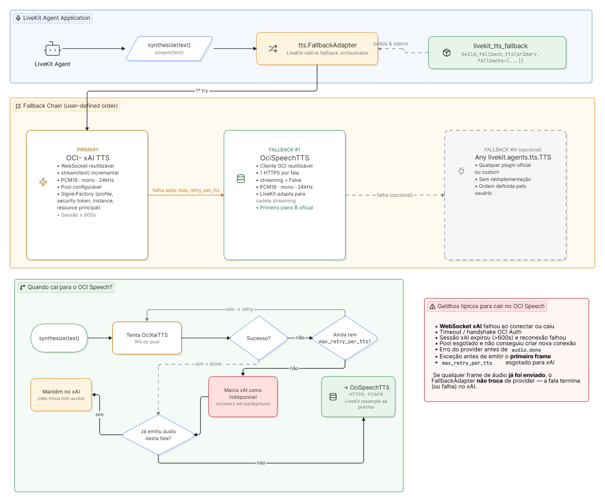

# LiveKit TTS Fallback

Biblioteca Python para compor uma cadeia de TTS usando o
`livekit.agents.tts.FallbackAdapter`.

O provider principal incluído é OCI Generative AI xAI Voice por WebSocket. O usuário
escolhe explicitamente os fallbacks. A biblioteca inclui OCI Speech e um helper opcional
para o plugin oficial da ElevenLabs, mas aceita qualquer implementação de
`livekit.agents.tts.TTS`.

## Arquitetura



## Comportamento

- Os providers são tentados na ordem informada.
- O fallback acontece somente se a falha ocorrer antes do primeiro áudio.
- Se uma fala já começou, o LiveKit não reinicia o texto em outro provider.
- Providers indisponíveis são recuperados pelo mecanismo nativo do LiveKit.
- OCI xAI reaproveita sessões WebSocket entre falas por meio de um pool.
- OCI Speech reutiliza o cliente SDK, mas abre uma requisição HTTPS por fala.
- ElevenLabs e providers externos gerenciam seus próprios transportes.
- Sample rates diferentes são reamostrados pelo `FallbackAdapter`; todos os providers
  precisam produzir áudio mono.

## Instalação

```bash
git clone https://github.com/julianoce-oracle/livekit-tts-fallback.git
cd livekit-tts-fallback

python3 -m venv .venv
source .venv/bin/activate
python -m pip install -e .
```

Para permitir que o usuário escolha ElevenLabs:

```bash
python -m pip install -e '.[elevenlabs]'
```

Para desenvolvimento:

```bash
python -m pip install -e '.[dev]'
```

## Configuração

Crie um arquivo local a partir do modelo e preencha somente os providers usados:

```bash
cp .env.example .env
```

Nunca versione `.env`, API keys, arquivos de chave privada ou áudios gerados.

## OCI xAI principal com OCI Speech como fallback

```python
from livekit.agents import AgentSession

from livekit_tts_fallback import (
    FallbackPolicy,
    OciSpeechConfig,
    OciSpeechTTS,
    OciXaiConfig,
    OciXaiTTS,
    build_fallback_tts,
)

primary = OciXaiTTS(
    OciXaiConfig(
        region="us-chicago-1",
        api_key_env="OCI_XAI_API_KEY",
        voice="ara",
        language="pt-BR",
    )
)

oci_speech = OciSpeechTTS(
    OciSpeechConfig(
        compartment_id="COMPARTMENT_OCID",
        voice_id="VOICE_ID_AVAILABLE_IN_THE_SELECTED_REGION",
        region="us-ashburn-1",
        profile="DEFAULT",
    )
)

fallback_tts = build_fallback_tts(
    primary,
    fallbacks=[oci_speech],
    policy=FallbackPolicy(
        max_retry_per_tts=0,
        output_sample_rate=24_000,
    ),
)

session = AgentSession(
    tts=fallback_tts,
    # stt=..., llm=..., vad=...
)
```

Nenhum fallback é adicionado automaticamente. Para usar somente OCI xAI:

```python
fallback_tts = build_fallback_tts(primary)
```

## ElevenLabs como escolha do usuário

```python
from livekit_tts_fallback import OciXaiTTS, build_fallback_tts
from livekit_tts_fallback.providers import create_elevenlabs_tts

primary = OciXaiTTS(...)
elevenlabs_tts = create_elevenlabs_tts(
    api_key="...",
    voice_id="...",
    model="eleven_multilingual_v2",
)

fallback_tts = build_fallback_tts(
    primary,
    fallbacks=[elevenlabs_tts],
)
```

O helper apenas importa e instancia o plugin oficial `livekit-plugins-elevenlabs`. A
biblioteca não implementa outro cliente ElevenLabs nem seleciona esse fallback sozinha.

## Adicionando qualquer outro provider

Se o provider já implementa `livekit.agents.tts.TTS`, basta fornecer a instância:

```python
custom_tts = MinhaImplementacaoLiveKitTTS(...)

fallback_tts = build_fallback_tts(
    primary,
    fallbacks=[custom_tts],
)
```

O provider é responsável por `synthesize()`, opcionalmente `stream()`, `prewarm()` e
`aclose()`. Reutilização de conexão também pertence ao provider. Não existe compartilhamento
de socket entre serviços diferentes.

## Configuração do pool OCI xAI

```python
from livekit_tts_fallback import OciXaiConfig, OciXaiTTS
from livekit_tts_fallback.transports import ConnectionPoolConfig

primary = OciXaiTTS(
    OciXaiConfig(
        pool=ConnectionPoolConfig(
            min_size=1,
            max_size=4,
            acquire_timeout_s=2.0,
            session_ttl_s=540.0,
            max_uses=None,
        )
    )
)
```

Cada socket atende uma fala de cada vez. Ao receber `audio.done`, a conexão saudável volta
ao pool. Conexões quebradas, vencidas ou liberadas após erro são fechadas. O TTL padrão é
540 segundos, abaixo do limite de 600 segundos documentado para a sessão OCI xAI.

## Política de fallback

`FallbackPolicy.max_retry_per_tts` controla quantos retries internos o LiveKit realiza antes
de seguir para o próximo provider. O padrão desta biblioteca é zero para evitar multiplicar
a latência de voz. Ou seja, quando `max_retry_per_tts=0` faz a biblioteca não repetir a mesma chamada no provider que falhou.

`FallbackPolicy.prewarm_fallbacks=False` aquece somente o primeiro provider. Quando definido
como `True`, chama `prewarm()` em toda a cadeia; cada provider decide o que pode preparar.

## Autenticação

OCI xAI usa a API key do serviço Generative AI enviada como Bearer token no handshake do
WebSocket. Ela pode ser passada diretamente em `OciXaiConfig.api_key` ou lida da variável
configurada por `api_key_env`.
Os parâmetros opcionais `optimize_streaming_latency` e `text_normalization` são omitidos por padrão. Quando configurado, o nível de otimização deve ser `0`, `1` ou `2`.

OCI Speech suporta:

- profile do arquivo OCI, incluindo profile com `security_token_file`;
- instance principal;
- resource principal.

Credenciais, textos e áudio não são registrados nos logs da biblioteca.

## Encerramento

O objeto deve viver pelo mesmo tempo que a `AgentSession`, preservando pool e estado de
disponibilidade. No encerramento:

```python
await fallback_tts.aclose()
```

`ManagedFallbackAdapter` encerra as tarefas de recuperação do LiveKit e os providers que
recebeu. Use `close_providers=False` somente quando o ciclo de vida for controlado por outro
componente.

## Teste de integração do fallback OCI Speech

O script `scripts/test_oci_speech_fallback.py` valida a cadeia LiveKit usando o OCI Speech
real. Por padrão, ele força uma falha interna no provider principal antes do primeiro frame,
sem alterar ou invalidar credenciais. Assim, o teste confirma especificamente que o
`FallbackAdapter` seleciona OCI Speech e produz áudio.

```bash
cd livekit-tts-fallback
source .venv/bin/activate

OCI_SPEECH_PROFILE=DEFAULT \
python scripts/test_oci_speech_fallback.py \
  --env-file .env
```

O arquivo padrão é `/tmp/livekit-oci-speech-fallback.wav`. Um resultado bem-sucedido termina
com uma linha semelhante a:

```text
RESULT=OK winner=oci-speech elapsed_ms=1233.342 frames=26 pcm_bytes=213644 output=/tmp/livekit-oci-speech-fallback.wav
```

### Modos de execução

A API da xAI não é chamada. O script usa `ForcedInternalFailureTTS` para reproduzir
uma falha interna antes do áudio e exercitar deterministicamente o fallback real. Ou seja, quando o LiveKit tenta sintetizar uma fala com ele, a classe gera intencionalmente um APIConnectionError antes de emitir qualquer frame de áudio:

```bash
python scripts/test_oci_speech_fallback.py \
  --env-file .env
```

## Teste de recuperação do xAI em uma janela de 30 segundos

O script `scripts/test_xai_recovery_window.py` valida o fluxo completo
`OCI xAI indisponível -> OCI Speech -> OCI xAI recuperado`.
Uma barreira interna força falhas antes do primeiro áudio por um período configurável. Depois
desse período, o próximo probe usa o WebSocket OCI xAI real.

```bash
cd livekit-tts-fallback
source .venv/bin/activate

OCI_SPEECH_PROFILE=DEFAULT \
python scripts/test_xai_recovery_window.py \
  --env-file .env \
  --monitor-seconds 30 \
  --recover-after-seconds 12 \
  --probe-interval-seconds 3 \
  --output-dir /tmp/livekit-xai-recovery-window
```

O fluxo esperado é:

1. A primeira síntese falha internamente no primary e produz áudio com OCI Speech.
2. O LiveKit marca OCI xAI como indisponível.
3. O script envia uma síntese curta a cada intervalo para acionar o mecanismo nativo de recovery.
4. Antes de 12 segundos, esses probes continuam falhando internamente e OCI Speech atende.
5. Depois de 12 segundos, o recovery probe abre o WebSocket OCI xAI real.
6. O LiveKit emite `available=True`, e a fala final precisa terminar com `winner=oci-xai`.

A janela de 30 segundos é o limite máximo de espera. O script termina antes quando detecta a
recuperação. Os áudios de validação são salvos como:

- `01-initial-oci-speech.wav`
- `02-restored-oci-xai.wav`

Opções principais:

| Opção | Padrão | Descrição |
| --- | --- | --- |
| `--monitor-seconds` | `30` | Limite máximo para o xAI recuperar. |
| `--recover-after-seconds` | `12` | Duração da falha interna simulada antes de permitir xAI real. |
| `--probe-interval-seconds` | `3` | Intervalo entre sínteses que acionam recovery probes. |
| `--request-timeout-seconds` | timeout OCI Speech + 5 | Timeout de cada síntese. |
| `--output-dir` | `/tmp/livekit-xai-recovery-window` | Diretório dos dois WAVs. |
| `--verbose-livekit` | desabilitado | Exibe os tracebacks esperados de fallback e recovery. |

O FallbackAdapter do LiveKit não executa verificações periódicas enquanto nenhuma fala está sendo sintetizada. Portanto, se o xAI for marcado como indisponível e a aplicação ficar ociosa, o LiveKit não enviará requisições em background para verificar se ele voltou.
A recuperação acontece quando uma nova síntese passa pela cadeia:
Nova síntese
  -> xAI está marcado como indisponível
  -> LiveKit usa OCI Speech para produzir o áudio
  -> em paralelo, tenta sintetizar o mesmo texto no xAI
  -> se o xAI responder, ele volta a ser marcado como disponível
  -> a próxima síntese volta a priorizar o xAI
O script de teste precisa gerar pequenas sínteses em intervalos regulares porque, sem novas requisições, o mecanismo nativo de recuperação não seria acionado.
Essas requisições não são health checks simples. Cada uma é uma síntese TTS completa:
OCI Speech gera o áudio enquanto o xAI está indisponível;
o LiveKit também tenta usar o xAI como teste de recuperação;
ambas as chamadas podem consumir cota e gerar cobrança.
Por isso, o script é apropriado para validar o fluxo de fallback e recuperação, mas não deve ser usado como monitor contínuo de produção.

### Opções

| Opção | Padrão | Descrição |
| --- | --- | --- |
| `--env-file PATH` | `.env` | Arquivo com as configurações OCI xAI e OCI Speech. |
| `--text TEXT` | Frase de confirmação em português | Texto enviado ao provider vencedor. |
| `--output PATH` | `/tmp/livekit-oci-speech-fallback.wav` | Arquivo WAV PCM16 mono com o áudio recebido pelo LiveKit. |
| `--real-primary` | desabilitado | Usa o OCI xAI real em vez da falha interna controlada. |
| `--log-level LEVEL` | `INFO` | Nível de log, como `DEBUG`, `INFO` ou `WARNING`. |
| `-h`, `--help` | - | Exibe a ajuda completa do script. |

Exemplo com texto e saída personalizados:

```bash
python scripts/test_oci_speech_fallback.py \
  --env-file .env \
  --text "Teste do fallback de voz." \
  --output /tmp/meu-fallback.wav \
  --log-level DEBUG
```

### Variáveis utilizadas

Para OCI Speech, o script lê `OCI_SPEECH_AUTH`, `OCI_SPEECH_CONFIG_FILE`,
`OCI_SPEECH_PROFILE`, `OCI_SPEECH_REGION`, `OCI_SPEECH_ENDPOINT`,
`OCI_SPEECH_COMPARTMENT_ID`, `OCI_SPEECH_TTS_MODEL`, `OCI_SPEECH_TTS_VOICE_ID`,
`OCI_SPEECH_TTS_LANGUAGE`, `OCI_SPEECH_TTS_FORMAT`, `OCI_SPEECH_TTS_TIMEOUT`,
`OCI_SPEECH_TTS_CONNECT_TIMEOUT`, `OCI_SPEECH_TTS_CHUNK_SIZE` e
`OCI_SPEECH_TTS_STREAM_ENABLED`.

No modo `--real-primary`, também lê `OCI_XAI_API_KEY` (ou `OCI_GENAI_API_KEY` por compatibilidade), `OCI_XAI_REGION`,
`OCI_XAI_ENDPOINT`, `OCI_XAI_VOICE` e `OCI_XAI_LANGUAGE`.

O nome esperado para a voz é `OCI_SPEECH_TTS_VOICE_ID`. A variável
`OCI_SPEECH_VOICE_ID` não é consumida por este script.

Profiles com `security_token_file` precisam estar autenticados e dentro da validade. Um
profile diferente pode ser usado somente para o processo, sem editar o `.env`:

```bash
OCI_SPEECH_PROFILE=DEFAULT \
python scripts/test_oci_speech_fallback.py \
  --env-file .env
```

O processo retorna código `0` em caso de sucesso e `1` quando o fallback não gera áudio ou alguma
configuração é inválida.


## Testes

```bash
pytest
ruff check .
```

Os testes unitários não fazem chamadas externas nem exigem credenciais OCI.
