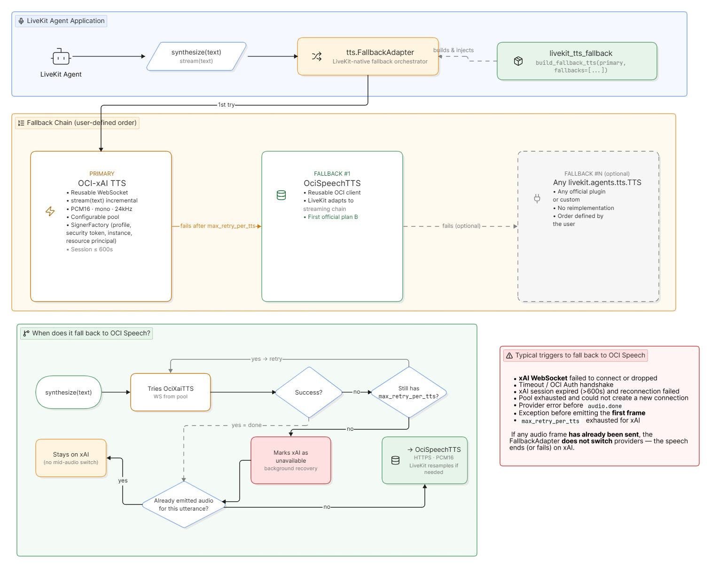

# LiveKit TTS Fallback

A Python library for composing a resilient TTS provider chain with
`livekit.agents.tts.FallbackAdapter`.

The included primary provider is OCI Generative AI xAI Voice over WebSocket. Users
explicitly choose the fallback providers and their order. For OCI Speech, the package
includes the `oracle` plugin and uses it like any other `livekit.agents.tts.TTS`
implementation. An optional helper for the official ElevenLabs plugin is also available.

## Architecture



## Behavior

- Providers are attempted in the order supplied by the user.
- Fallback occurs only when a provider fails before emitting the first audio frame.
- After speech has started, LiveKit does not restart the same text with another provider.
- Unavailable providers are recovered by LiveKit's native recovery mechanism.
- OCI xAI reuses WebSocket sessions across utterances through a connection pool.
- `oracle.TTS` reuses the OCI SDK client and receives PCM audio in HTTPS chunks for each utterance.
- ElevenLabs and external providers manage their own transports.
- `FallbackAdapter` resamples providers with different sample rates. Every provider must
  produce mono audio.

## Installation

```bash
git clone https://github.com/julianoce-oracle/livekit-tts-fallback.git
cd livekit-tts-fallback

python3 -m venv .venv
source .venv/bin/activate
python -m pip install -e .
```

To make ElevenLabs available as a user-selected fallback:

```bash
python -m pip install -e '.[elevenlabs]'
```

For development:

```bash
python -m pip install -e '.[dev]'
```

## Configuration

Create a local configuration file from the template and populate only the providers you use:

```bash
cp .env.example .env
```

Never commit `.env`, API keys, private key files, generated audio, or other credentials.

## OCI xAI primary with OCI Speech fallback

```python
import os

import oci
import oracle
from livekit.agents import AgentSession

from livekit_tts_fallback import (
    FallbackPolicy,
    OciXaiConfig,
    OciXaiTTS,
    build_fallback_tts,
)

config = oci.config.from_file(
    file_location=os.getenv("OCI_SPEECH_CONFIG_FILE") or oci.config.DEFAULT_LOCATION,
    profile_name=os.getenv("OCI_SPEECH_PROFILE", "DEFAULT"),
)

primary = OciXaiTTS(
    OciXaiConfig(
        region="us-chicago-1",
        api_key_env="OCI_XAI_API_KEY",
        voice="ara",
        language="pt-BR",
    )
)

oci_speech = oracle.TTS(
    config=config,
    region="us-ashburn-1",
    compartment_id=os.environ["OCI_SPEECH_COMPARTMENT_ID"],
    voice_id=os.environ["OCI_SPEECH_TTS_VOICE_ID"],
    language_code="pt-BR",
    samples_rate_in_hz=24_000,
)

fallback_tts = build_fallback_tts(
    primary,
    fallbacks=[oci_speech],
    policy=FallbackPolicy(
        max_retry_per_tts=0,
        output_sample_rate=24_000,
    ),
)

session = AgentSession(
    tts=fallback_tts,
    # stt=..., llm=..., vad=...
)
```

The `oracle.TTS` plugin sends `is_stream_enabled=True` to OCI Speech and consumes
`response.data.raw.stream()`. It declares `streaming=False` to LiveKit because OCI
Speech requires the complete input text before each request begins. These settings describe
different directions of the operation: LiveKit text-input streaming is disabled, while the
OCI HTTPS audio response is still consumed incrementally in chunks.

No fallback is added automatically. To use only OCI xAI:

```python
fallback_tts = build_fallback_tts(primary)
```

## ElevenLabs as a user-selected fallback

```python
from livekit_tts_fallback import OciXaiTTS, build_fallback_tts
from livekit_tts_fallback.providers import create_elevenlabs_tts

primary = OciXaiTTS(...)
elevenlabs_tts = create_elevenlabs_tts(
    api_key="...",
    voice_id="...",
    model="eleven_multilingual_v2",
)

fallback_tts = build_fallback_tts(
    primary,
    fallbacks=[elevenlabs_tts],
)
```

The helper only imports and instantiates the official
`livekit-plugins-elevenlabs` plugin. This library does not implement a separate
ElevenLabs client and does not select ElevenLabs automatically.

## Adding any other provider

If a provider already implements `livekit.agents.tts.TTS`, supply its instance directly:

```python
custom_tts = MyLiveKitTTS(...)

fallback_tts = build_fallback_tts(
    primary,
    fallbacks=[custom_tts],
)
```

The provider owns its `synthesize()`, optional `stream()`, `prewarm()`, and
`aclose()` behavior. Connection reuse also belongs to each provider. Sockets are never
shared across different services.

## OCI xAI connection pool

```python
from livekit_tts_fallback import OciXaiConfig, OciXaiTTS
from livekit_tts_fallback.transports import ConnectionPoolConfig

primary = OciXaiTTS(
    OciXaiConfig(
        pool=ConnectionPoolConfig(
            min_size=1,
            max_size=4,
            acquire_timeout_s=2.0,
            session_ttl_s=540.0,
            max_uses=None,
        )
    )
)
```

Each socket handles one utterance at a time. After `audio.done`, a healthy connection
returns to the pool. Broken, expired, or error-released connections are closed. The default
TTL is 540 seconds, below the documented 600-second OCI xAI session limit.

## Fallback policy

`FallbackPolicy.max_retry_per_tts` controls how many internal retries LiveKit performs
before moving to the next provider. The library default is zero to avoid multiplying voice
latency. With `max_retry_per_tts=0`, LiveKit does not repeat the failed request on the same
provider before trying the fallback.

`FallbackPolicy.prewarm_fallbacks=False` prewarms only the first provider. When set to
`True`, the adapter invokes `prewarm()` for the entire chain, and each provider decides
what it can prepare.

## Authentication

OCI xAI uses a Generative AI service API key sent as a Bearer token during the WebSocket
handshake. Pass it directly through `OciXaiConfig.api_key` or load it from the environment
variable named by `api_key_env`.

The optional `optimize_streaming_latency` and `text_normalization` parameters are omitted
by default. When configured, `optimize_streaming_latency` must be `0`, `1`, or `2`.

`oracle.TTS` supports:

- a preloaded OCI `config` mapping, as shown above;
- an OCI configuration profile, including profiles with `security_token_file`;
- instance principal authentication with `auth="instance_principal"`;
- resource principal authentication with `auth="resource_principal"`.

The plugin does not log OCI configuration content, compartment OCIDs, input text, or audio.
The library does not log credentials, text, or audio payloads.

## Lifecycle and shutdown

Keep the adapter alive for the same lifetime as the `AgentSession` so it can preserve the
connection pool and provider availability state. During shutdown:

```python
await fallback_tts.aclose()
```

`ManagedFallbackAdapter` closes LiveKit recovery tasks and every provider it owns. Use
`close_providers=False` only when another component controls provider lifecycles.

## OCI Speech fallback integration test

The `scripts/test_oci_speech_fallback.py` script validates the LiveKit chain against the
real OCI Speech service. By default, it forces an internal primary-provider failure before
the first audio frame without modifying or invalidating credentials. This specifically
confirms that `FallbackAdapter` selects OCI Speech and produces audio.

```bash
cd livekit-tts-fallback
source .venv/bin/activate

OCI_SPEECH_PROFILE=DEFAULT \
python scripts/test_oci_speech_fallback.py \
  --env-file .env
```

The default output is `/tmp/livekit-oci-speech-fallback.wav`. A successful run ends with
a line similar to:

```text
RESULT=OK winner=oci-speech elapsed_ms=1233.342 frames=26 pcm_bytes=213644 output=/tmp/livekit-oci-speech-fallback.wav
```

### Execution modes

In the default mode, the script does not call OCI xAI. It uses
`ForcedInternalFailureTTS` to deterministically reproduce an internal error before any
audio is emitted. When LiveKit requests an utterance, this test provider intentionally
raises `APIConnectionError`, and the real OCI Speech fallback handles the utterance:

```bash
python scripts/test_oci_speech_fallback.py \
  --env-file .env
```

To call the real OCI xAI provider as the primary, add `--real-primary`:

```bash
python scripts/test_oci_speech_fallback.py \
  --env-file .env \
  --real-primary
```

In this mode, OCI Speech is called only when the real OCI xAI request fails before the
first audio frame. The result reports `winner=oci-xai` when the primary succeeds and
`winner=oci-speech` when fallback is activated.

### Options

| Option | Default | Description |
| --- | --- | --- |
| `--env-file PATH` | `.env` | File containing OCI xAI and OCI Speech settings. |
| `--text TEXT` | Built-in confirmation sentence | Text sent to the winning provider. |
| `--output PATH` | `/tmp/livekit-oci-speech-fallback.wav` | PCM16 mono WAV produced from the frames received by LiveKit. |
| `--real-primary` | Disabled | Uses the real OCI xAI provider instead of the controlled internal failure. |
| `--log-level LEVEL` | `INFO` | Logging level, such as `DEBUG`, `INFO`, or `WARNING`. |
| `-h`, `--help` | - | Displays the complete command-line help. |

Example with custom text and output:

```bash
python scripts/test_oci_speech_fallback.py \
  --env-file .env \
  --text "This is a voice fallback test." \
  --output /tmp/custom-fallback.wav \
  --log-level DEBUG
```

### Environment variables

For OCI Speech, the script reads `OCI_SPEECH_AUTH`, `OCI_SPEECH_CONFIG_FILE`,
`OCI_SPEECH_PROFILE`, `OCI_SPEECH_REGION`, `OCI_SPEECH_ENDPOINT`,
`OCI_SPEECH_COMPARTMENT_ID`, `OCI_SPEECH_TTS_MODEL`,
`OCI_SPEECH_TTS_VOICE_ID`, `OCI_SPEECH_TTS_LANGUAGE`,
`OCI_SPEECH_TTS_SAMPLE_RATE`, `OCI_SPEECH_TTS_FORMAT`,
`OCI_SPEECH_TTS_TIMEOUT`, `OCI_SPEECH_TTS_CONNECT_TIMEOUT`,
`OCI_SPEECH_TTS_CHUNK_SIZE`, and `OCI_SPEECH_TTS_STREAM_ENABLED`.

The plugin requires PCM output and OCI response streaming. For compatibility with older
configuration files, the test script overrides a non-PCM
`OCI_SPEECH_TTS_FORMAT` with `PCM` and logs a warning.

With `--real-primary`, the script also reads `OCI_XAI_API_KEY`, or
`OCI_GENAI_API_KEY` for compatibility, plus `OCI_XAI_REGION`,
`OCI_XAI_ENDPOINT`, `OCI_XAI_VOICE`, and `OCI_XAI_LANGUAGE`.

The expected voice variable is `OCI_SPEECH_TTS_VOICE_ID`.
`OCI_SPEECH_VOICE_ID` is not read by this script.

Profiles containing `security_token_file` must be authenticated and unexpired. To select
a different profile for a single process without editing `.env`:

```bash
OCI_SPEECH_PROFILE=DEFAULT \
python scripts/test_oci_speech_fallback.py \
  --env-file .env
```

The process returns exit code `0` on success and `1` when fallback produces no audio or
configuration is invalid.

## OCI xAI recovery-window integration test

The `scripts/test_xai_recovery_window.py` script validates the complete flow:

```text
OCI xAI unavailable -> OCI Speech -> OCI xAI recovered
```

An internal gate forces failures before the first audio frame for a configurable period.
After that period, the next recovery probe uses the real OCI xAI WebSocket.

```bash
cd livekit-tts-fallback
source .venv/bin/activate

OCI_SPEECH_PROFILE=DEFAULT \
python scripts/test_xai_recovery_window.py \
  --env-file .env \
  --monitor-seconds 30 \
  --recover-after-seconds 12 \
  --probe-interval-seconds 3 \
  --output-dir /tmp/livekit-xai-recovery-window
```

Expected flow:

1. The first synthesis fails internally in the primary and OCI Speech produces the audio.
2. LiveKit marks OCI xAI as unavailable.
3. The script submits a short synthesis at each interval to activate LiveKit's native recovery.
4. Before 12 seconds, the probes continue to fail internally and OCI Speech handles them.
5. After 12 seconds, the recovery probe opens the real OCI xAI WebSocket.
6. LiveKit emits `available=True`, and the final utterance must report `winner=oci-xai`.

The 30-second window is a maximum wait time. The script exits earlier when recovery is
detected. Validation audio is written as:

- `01-initial-oci-speech.wav`
- `02-restored-oci-xai.wav`

Main options:

| Option | Default | Description |
| --- | --- | --- |
| `--monitor-seconds` | `30` | Maximum time allowed for OCI xAI recovery. |
| `--recover-after-seconds` | `12` | Duration of the simulated internal failure before real OCI xAI is allowed. |
| `--probe-interval-seconds` | `3` | Interval between synthesis requests that activate recovery probes. |
| `--request-timeout-seconds` | OCI Speech timeout + 5 | Timeout for each synthesis request. |
| `--output-dir` | `/tmp/livekit-xai-recovery-window` | Directory for the two WAV files. |
| `--verbose-livekit` | Disabled | Displays expected fallback and recovery tracebacks. |

### How native recovery is activated

LiveKit's `FallbackAdapter` does not poll unavailable providers while the application is
idle. If OCI xAI is unavailable and no speech is being synthesized, LiveKit sends no
background request to check whether it has recovered.

Recovery is activated when a new synthesis request crosses the chain:

```text
New synthesis request
  -> OCI xAI is marked unavailable
  -> LiveKit uses OCI Speech to produce audio
  -> LiveKit concurrently attempts the same text on OCI xAI as a recovery probe
  -> if OCI xAI succeeds, LiveKit marks it available
  -> the next synthesis prioritizes OCI xAI again
```

The test script submits short synthesis requests at regular intervals because native
recovery cannot run without new requests. These are complete TTS synthesis operations, not
free health checks:

- OCI Speech generates audio while OCI xAI is unavailable.
- LiveKit also attempts OCI xAI to evaluate recovery.
- Both calls can consume quota and incur charges.

This script is intended for fallback and recovery integration validation. It must not be
used as a continuous production monitor.

## Tests

```bash
pytest
ruff check .
```

Unit tests make no external calls and require no OCI credentials.
